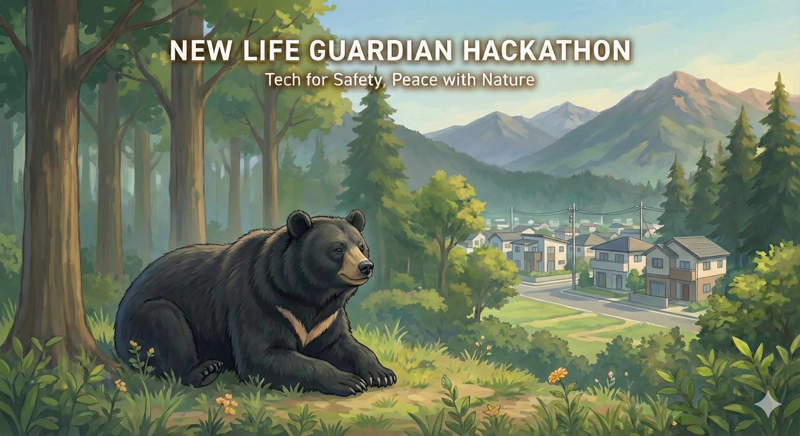

# New Life Guardian Hackathon 実施要項

## 1. ハッカソン開催の背景と目的
**「恐怖を安心へ、技術で家族を守る」**

2週間後に引越しを控えた主催者家族の新居付近（徒歩4分）で熊の目撃情報がありました。
主催者は多忙ですが、ITエンジニアとしてのスキルを持っています。
本ハッカソンでは、**「引越し初日から使える、家族の安全と安心を守るための具体的なソリューション」**を開発することを目的とします。

## 2. ターゲットユーザー（主催者家族）

* **構成:** 夫婦（30代、スマホ所持）、子供（1名）
* **状況:**
    * **居住地:** 長野市内（以前から住んでたことがあり、ある程度の地理勘はある）。
    * **ライフスタイル:**
        * **夫:** 自宅でリモートワークに従事（ITエンジニア）。
        * **妻・子供:** 幼稚園の送迎や買い物などで日常的に外出する機会が多い。
* **心理状態:**
    * 「いつ熊が出るかわからない」という漠然とした恐怖感が強い。
    * 地理勘があるため、日常の行動範囲と危険エリアが重なることに敏感になっている。
* **技術リテラシー:**
    * **夫は現役のITエンジニア。**
    * 環境構築やデータ加工（ETL）の手順が明確であれば、実装・運用が可能。

## 3. 開発要件・制約事項

### ソリューションの方向性（自由提案）
必須機能の指定はありません。「在宅の夫が、外出する家族の安全をどう守るか」という観点から、最適な解決策を提案・実装してください。

### 技術的制約
* **デプロイ/起動:**
    * エンジニアが再現可能な手順であること（Docker, npm, python script等）。
* **データ:**
    * 長野市の熊出没情報（PDF等）の活用を推奨。
    * [長野市 令和7年度クマ目撃等情報](https://www.city.nagano.nagano.jp/documents/3071/kuma20251031.pdf)
    * 必要に応じてPDFからのデータ抽出や、構造化したモックデータ（JSON/CSV）の使用を許可する。

## 4. 提出物規定

以下の成果物を含むリポジトリ構造を出力してください。

### A. ソースコード一式
* プロトタイプとして動作するもの。

### B. `README.md`
* **Prerequisites:** 必要なランタイム、APIキー等。
* **Setup & Installation:** 環境構築手順。
* **Data Pipeline:** データの取り込み・更新手順。
* **Usage:** アプリケーションの操作方法。

### C. `SOLUTION.md` (ピッチ資料)
1.  **解決したい課題:** ユーザーの生活スタイルに即した課題設定。
2.  **課題の解決方法:** アプローチの詳細。
3.  **利用した技術スタック:** 選定理由。
4.  **実運用にあたって必要なランニングコスト:** 概算費用。

### 5. 評価基準

1.  **課題解決の適合性:** リモートワークの夫と外出する家族の「安心」に繋がるか。
2.  **技術的実現性:** 実データ（PDF等）の更新に対応できる設計になっているか。
3.  **エンジニアリング:** データの取得から可視化/通知までのフローが論理的か。
4.  **動物愛護・共存の視点（重要）:**
    * クマを過度に傷つけたり、生態系に悪影響を与える攻撃的な手法（駆除・捕獲前提）ではないこと。
    * 「出会わないための回避」「傷つけずに遠ざける追い払い」など、共存を前提としたソリューションであること。